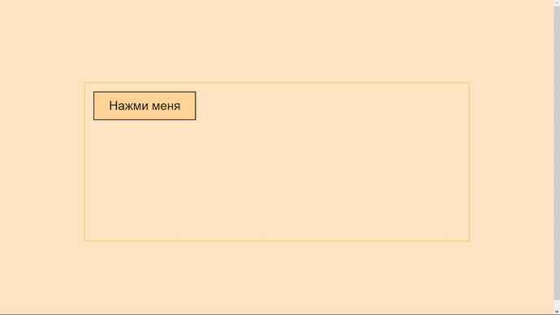
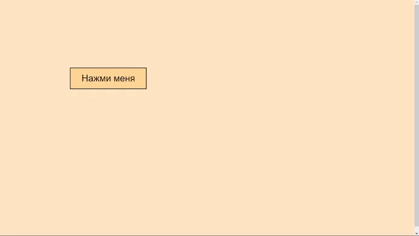

# JavaScript

JavaScript это язык, который позволяет вам применять сложные вещи на web странице — каждый раз, 
когда на web странице происходит что-то большее, чем просто её статичное отображение — отображение 
периодически обновляемого контента, или интерактивных карт, или анимация 2D/3D графики, или прокрутка видео в проигрывателе, 
и т.д. — это JavaScript.

## Подключение JavaScript

Самый простой способ внедрения JavaScript в HTML-документ – использование тега `

      
Выходим обратно в HTML

    </body>
    </html>
    
Если JavaScript-кода много – его выносят в отдельный файл, который, как правило, имеет расширение `.js`.

Чтобы включить в HTML-документ JavaScript-кoд из внешнего файла, нужно использовать атрибут `src` (source) тега `
    
## Базовые элементы JavaScript

### Комментарии

Комментарии необходимы в коде для улучшения его понимания. В JavaScript есть два вида комментариев — однострочные и многострочные.

Однострочный комментарий объявляется двойным слешем `//`. Всё что будет написано после него в строке, браузер просто не увидит. Зато увидит и прочитает программист.

    // Комментарий

Многострочный комментарий объявляется и заканчивается слешем со звёздочкой.

    /* Комментарий
    комментарий
    комментарий */
    
### alert

Команда `alert` относится к функциям взаимодействия с пользователем. 
Она выводит модальное окно с сообщением, и приостанавливает выполнение скрипта пока пользователь не нажмёт ОК.

    
    
### prompt

prompt также функция взаимодействия, но в отличие от alert выводит модальное окно с полем для ввода текста и кнопками ОК и CANCEL.

Пользователю задаётся вопрос и предлагается ввести ответ, после чего нажать ОК, или ничего не вводить и нажать CANCEL (отмена)

Выполнение сценария приостанавливается до ответа пользователя.

    
    
### Переменные

Переменные в javascript объявляются ключевым словом var

    var имя_переменной = данные хранимые переменной;
    
### Функция

Функция — это некоторый объём кода, который выполняется в определённом месте, или нескольких местах программы.

Объявляется функция ключевым словом `function`, после которого пишется имя функции и круглые скобки, в которые вставляются параметры.

    function i_am_learning_JS()
    {
      // Тело функции
    }
    
### Операторы

+ ++ — инкремент. Унарный оператор увеличивающий значение операнда на 1
+ –– — декремент. Унарный оператор уменьшающий значение операнда на 1.
+ % — взятие остатка. Бинарный оператор. Это число которое получается в остатке при делении одного операнда на другой.
+ == — равно. Оператор сравнения
+ === — строго равно. Оператор сравнения
+ ! — отрицание. Читается как НЕ. Логический оператор.
+ || — ограничение. Читается как ИЛИ. Логический оператор.
+ && — обобщение. Читается как И. Логический оператор.

### Конструкция if — else

if — условный оператор, в тело которого вводится условие.

else — дополнительное условие. Подключается в том случае, если if определит первое условие как неверное.

    if (a == 5)
    {
      // Действие
    }
    else
    {
      // Дествие
    }
    
### Цикл for

Цикл используется для того, чтобы провести неоднократно какое либо однотипное действие.

    for (var i = 0: i < 13; i++)
    {
      // Тело цикла
    }
    
### Цикл while

    while (i < 13)
    {
      // Тело цикла
    }
    
### Массив

Массив - это тоже переменная, но если в простой переменной содержится один блок данных, то в массиве их несколько.

    var m = ['один', 'два','три','четыре','пять'];
    m[2] = 'другое значение';
    
## HTML JavaScript

### Доступ к элементам

+ Доступ по имени тега

Можно использовать имя тега

    var button1 = document.button

Либо создаётся доступ с помощью объекта `document` с методом `getElementsByTagName`

    var button1 = document.getElementsByTagName('button');
    
Так как тегов на html странице обычно бывает много, то `javascript` воспринимает обращение к ним, как обращение к массиву.

    var button1 = document.getElementsByTagName('button')[0];
    
+ Доступ по `id` элемента

Используем тот же объект `document` с другим методом `getElementById`

    var button1 = document.getElementById('btn')
    
+ Доступ по имени элемента

В html есть несколько тегов у которых в спецификации предусмотрен атрибут `name`.

Это теги формы `form`, `input`, `select`, `textarea` и тег ссылка `a`.

    <form name="forma">
      Введите число: <input type="text" name="t1">  
      <input type="button" value="Вычислить квадрат числа" onClick="esample();">  
      <input type="text" name="res">
    </form>
    
    
    
### События в HTML

Событие – это сигнал от браузера о том, что что-то произошло. Все `DOM`-узлы подают такие сигналы.

#### События мыши

+ `click` – происходит, когда кликнули на элемент левой кнопкой мыши (на устройствах с сенсорными экранами оно происходит при касании).
+ `contextmenu` – происходит, когда кликнули на элемент правой кнопкой мыши.
+ `mouseover / mouseout` – когда мышь наводится на / покидает элемент.
+ `mousedown / mouseup` – когда нажали / отжали кнопку мыши на элементе.
+ `mousemove` – при движении мыши.

#### События на элементах управления

+ `submit` – пользователь отправил форму `<form>`.
+ `focus` – пользователь фокусируется на элементе, например нажимает на `<input>`.

#### Клавиатурные события

+ `keydown и keyup` – когда пользователь нажимает / отпускает клавишу.

#### События CSS

+ `transitionend` – когда `CSS-анимация` завершена.

### Обработчики событий

Событию можно назначить обработчик, то есть функцию, которая сработает, как только событие произошло.

Именно благодаря обработчикам `JavaScript`-код может реагировать на действия пользователя.

Пример обработки события нажатия на кнопку `button`, используя безымянную функцию:

    var button_start = document.getElementById('btn_start');
    
    button_start.onclick = function() {
      alert('Вы нажали на кнопку');
    }
    
Пример обработки события нажатия на кнопку `button`, используя уже созданную функцию:

    var button_start = document.getElementById('btn_start');
    
    button_start.onclick = btn_start;
    
    function btn_start() {
      alert('Вы нажали на кнопку');
    }
    
Внимание! Функция должна быть присвоена как `btn_start`, а не `btn_start()`.

#### addEventListener

Фундаментальный недостаток описанных выше способов назначения обработчика – невозможность повесить несколько обработчиков на одно событие.

Например, одна часть кода хочет при клике на кнопку делать её подсвеченной, а другая – выдавать сообщение.

Разработчики стандартов предложили альтернативный способ назначения обработчиков при помощи специальных методов `addEventListener` и `removeEventListener`. 
Они свободны от указанного недостатка.

Синтаксис добавления обработчика:

    element.addEventListener(event, handler, [options]);
    
+ `event` - имя события, например `"click"`.
+ `handler` - ссылка на функцию-обработчик.
+ `options` - дополнительный объект со свойствами:
    + `once`: если `true`, тогда обработчик будет автоматически удалён после выполнения.
    + `capture`: фаза, на которой должен сработать обработчик.
    + `passive`: если `true`, то указывает, что обработчик никогда не вызовет `preventDefault()`.

Для удаления обработчика следует использовать `removeEventListener`:

    element.removeEventListener(event, handler, [options]);
    
## Изменение CSS свойств с помощью JavaScript

Для доступа к стилям существует специальное свойство объекта — `style`. Пусть на странице определён элемент с идентификатором `elem`:

    
DIV

    
Тогда, для доступа к его «стилевым» свойствам, нужно получить доступ к этому элементу:

    var elem_div = document.getElementById('elem');
    
Вам известны различные `CSS` свойства: `background`, `border`, `display`, `font-size` и т. п. 
Обратите внимание на последнее, в котором есть символ `-` (минус на клавиатуре). 
В названиях переменных такие дефисы использовать нельзя, поскольку в контексте программы они интерпретируются как знак вычитания.

Поэтому, имена свойств требуется «причесать» (нормализовать) для использования в коде. К счастью, определено всего 2 простых правила:

Если знака минус нет (`margin`, `border`, `width` и прочее) — записывается как есть:

    // установить элементу ширину в 30 пикселей
    elem_div.style.width = '30px';
    
Если знак минус присутствует, то он убирается, а следующая буква переводится в верхний регистр: `background-color` → `backgroundСolor`, `z-index` → `zIndex` и т.д.:

    // Сделать фон красным
    document.getElementById('elem').style.backgroundColor = '#FF0000';
    
## Домашнее задание

1. Добавить кнопку на вашем проекте с 1-3 заданий для изменения темы вашего сайта. Спомощью `JavaScript` реализовать изменение темы. Также добавить возможность при повторном нажатии на кнопку поменять тему обратно.
2. С помощью `JavaScript` реализовать всем известный функционал повеения кнопки, которая убегает от мышки.

#### Легкий вариант

#### Вариант посложнее

