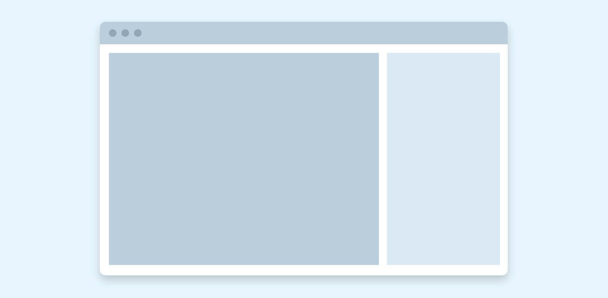
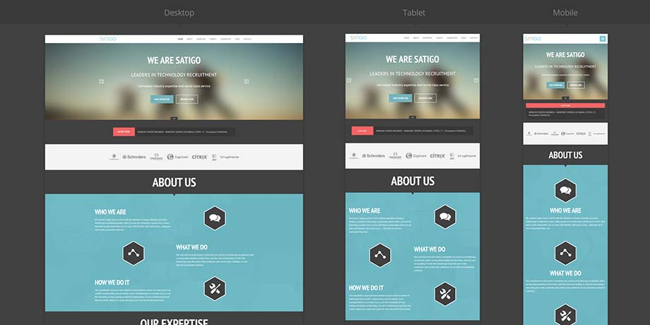

# Адаптивная верстка. Многостраничный сайт

## Адаптивная верстка

Адаптивная верстка сайта — это формирование структуры документа на базе HTML-разметки, предусматривающей автоматическое
изменение страницы в зависимости от размера экрана пользователя. Простыми словами это макет страницы, автоматически
подстраивающийся под размер экрана пользователя.

### Разница между адаптивной и мобильной версией сайта

Мобильная версия сайта, технически, является другим сайтом, и располагается по другому адресу (например vk.com и
m.vk.com). Адаптивный сайт - это одновременно мобильная и десктопная версия сайта, которая умеет подстраиваться к любому
типу клиентских устройств (компьютеров, планшетов, телефонов с разными размера экрана)

### CSS медиазапросы

Одним из самых важных инструментов при создании адаптивной вёрстки является использование медиазапросов. Медиазапросы —
специальные условные конструкции, которые позволяют применять стили только для определённых устройств.

    @media (условия) {
    /* CSS-код, который будет выполнен для данного условия */
    }

В качестве условия могут выступать различные значения. Зачастую используются следующие конструкции:

**Версия сайта для печати**

    @media print {
        header, footer {
            display:none
        }
    }

**Ориентация экрана**: landscape / portrait

    @media (orientation: landscape) {
    /* При горизонтальной ориентации фоновым цветом сайта будет белый */
        body {
           background: #FFF;
        }
    }
        
    @media (orientation: portrait) {
        /* При вертикальной ориентации фоновым цветом сайта будет чёрный */
        body {
            background: #000;
        }
    }

**Разрешение экрана**

    

**Логические операторы**

Условия внутри медиазапросов можно комбинировать. Для этого существует три логических оператора:

1. Логическое «И». Означает, что несколько условий должны быть выполнены для того, чтобы CSS-стили применились к
   элементу. Для использования логического «И» используется ключевое слово `and`.
2. Логическое «ИЛИ». Свойства применятся в том случае, если хотя бы одно из условий будет выполнено. Условия для этого
   отделяются запятыми

      @media (orientation: portrait) and (min-width: 600px) {
         .container { /* Для устройств с портретной ориентацией и
         шириной viewport не менее 600 пикселей сделать элементы с классом container шириной в 100 процентов */ 
            width: 100%;
         }
      }
   
      @media (orientation: portrait), (min-width: 600px) {
         .container { /* Для устройств с портретной ориентацией ИЛИ
         шириной viewport не менее 600 пикселей сделать элементы с классом container шириной в 100 процентов */
            width: 100%;
         }
      }

### Использование медиазапросов при подключении CSS

Медиазапросы возможно писать не только внутри CSS-файла, но и использовать их в HTML при подключении файла стилей. В
этом случае медиазапрос указывается в атрибуте media.

    <!DOCTYPE html>
    <html lang="ru">
    <head>
        <meta charset="UTF-8">
        <meta name="viewport" content="width=device-width, initial-scale=1.0">
        <title>Document</title>
        <!-- Общие стили для проекта -->
        <link rel="stylesheet" href="style.css">
    
        <!-- Стили для экранов с viewport не менее 750px -->
        <link rel="stylesheet" media="screen and (min-width: 750px)" href="style750px.css">
    
    </head>

### Основные брейк пойнты

Точки, в которых размер достаточно изменился для того чтобы к нему пора было применять новый набор стилей называются
брейк пойнтами. В ходе выполнения задания вы можете использовать точки, какие вам покажутся наиболее подходящими, но
нужно знать что существует набор наиболее часто используемых брейк пойнтов, включающий в себя 6 точек:
(Например в `bootstrap` существуют стили для каждой из этих точек, применять которые можно при помощи короткого названия
брейк пойнт)

| Breakpoint      | Название | Размер |
| ----------- | ----------- | -----------  |
|X-Small    | None    | <576px |
|Small    |sm    | ≥576px |
|Medium    | md    | ≥768px |
|Large    |lg    | ≥992px |
|Extra large    | xl    | ≥1200px |
|Extra extra large    | xxl    |≥1400px|

P.S на самом деле, если сайт разрабатывается без бутстрапа, обычно используется только 3 брейк пойнта

1. До 767px (мобильные телефоны)
2. От 768px до 1024 (планшеты)
3. До 1024px (десктопы)

      @media (min-width: 1025px) { }
      @media (min-width: 768px) and (max-width: 1024px)  { }
      @media (max-width: 767px) { }

## Задание

1. Добавить на сайт из второго задания страницу контакты и реализовать навигацию между новой и старой страницами
(15.09 пример на [хостинге](https://d1mazavr1k.github.io/webtech/))
2. Внедрить для обоих страниц адаптивную верстку с использованием медиа запросов и флексбоксов
(если в мобильной версии будет присутствовать горизонтальный скролл, задание не принимается)
